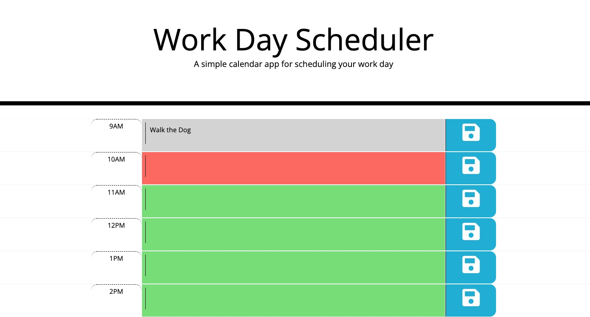

# Challenge-5-workday

## Description
This project was created so that a user can plan their workday beginning at 10am and ending at 6pm. When a user enters a task it is saved in local storage so that when they reload the page the task will also be loaded. The hours are color coded to indicate the past, present, and future. 

This project utilizes moment, local Storage, JavaScript, Jquery, and Bootstrap. I learned how to style using bootstrap and jquery along with using moment to define time.
## Usage
A user enters a task for their workday at a selected time between 9am - 5pm. Past due tasks turn gray, future tasks are green and the present hour is highlighted red. After entering a task and selecting the "save" button the task will remain on that line every time you refresh the browser.

## Credits
T.A. Eric Sayer and tutor Armando Osario
## License
MIT License

Copyright (c) 2021 Sabriel Gee

Permission is hereby granted, free of charge, to any person obtaining a copy of this software and associated documentation files (the "Software"), to deal in the Software without restriction, including without limitation the rights to use, copy, modify, merge, publish, distribute, sublicense, and/or sell copies of the Software, and to permit persons to whom the Software is furnished to do so, subject to the following conditions:

The above copyright notice and this permission notice shall be included in all copies or substantial portions of the Software.

THE SOFTWARE IS PROVIDED "AS IS", WITHOUT WARRANTY OF ANY KIND, EXPRESS OR IMPLIED, INCLUDING BUT NOT LIMITED TO THE WARRANTIES OF MERCHANTABILITY, FITNESS FOR A PARTICULAR PURPOSE AND NONINFRINGEMENT. IN NO EVENT SHALL THE AUTHORS OR COPYRIGHT HOLDERS BE LIABLE FOR ANY CLAIM, DAMAGES OR OTHER LIABILITY, WHETHER IN AN ACTION OF CONTRACT, TORT OR OTHERWISE, ARISING FROM, OUT OF OR IN CONNECTION WITH THE SOFTWARE OR THE USE OR OTHER DEALINGS IN THE SOFTWARE.
